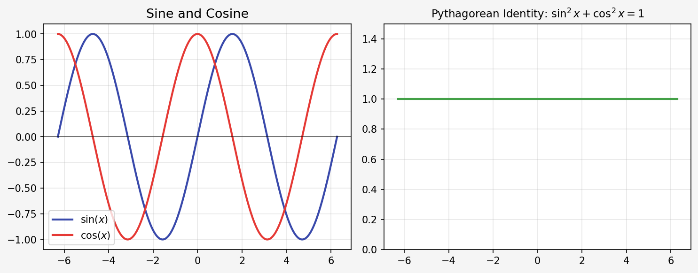

# Aldus Test Document

<table align="center">
  <tr>
    <td>
<pre>
  █████╗ ██╗     ██████╗ ██╗   ██╗███████╗
 ██╔══██╗██║     ██╔══██╗██║   ██║██╔════╝
 ███████║██║     ██║  ██║██║   ██║███████╗
 ██╔══██║██║     ██║  ██║██║   ██║╚════██║
 ██║  ██║███████╗██████╔╝╚██████╔╝███████║
 ╚═╝  ╚═╝╚══════╝╚═════╝  ╚═════╝ ╚══════╝
    A   L   E   X        T   I   A   N
         📜 Copyright © Alex Tian</pre>
    </td>
  </tr>
</table>

> This document tests every feature Aldus must handle: headings, math, tables, images, code blocks, blockquotes, and lists.

---

## Table of Contents

1. [Headings](#headings)
2. [Inline Math](#inline-math)
3. [Display Math](#display-math)
4. [Tables](#tables)
5. [Images](#images)
6. [Code Blocks](#code-blocks)
7. [Blockquotes](#blockquotes)
8. [Lists](#lists)
9. [Text Formatting](#text-formatting)
10. [Mixed Math and Text](#mixed-math-and-text)

---

## Headings

### Heading 3
#### Heading 4

---

## Inline Math

The quadratic formula is $x = \dfrac{-b \pm \sqrt{b^2 - 4ac}}{2a}$.

The area of a circle is $A = \pi r^2$, and the circumference is $C = 2\pi r$.

Einstein's famous equation: $E = mc^2$.

The slope of a line: $m = \dfrac{y_2 - y_1}{x_2 - x_1}$.

---

## Display Math

The Pythagorean theorem:

$$a^2 + b^2 = c^2$$

The sine law:

$$\frac{a}{\sin A} = \frac{b}{\sin B} = \frac{c}{\sin C}$$

The quadratic formula:

$$x = \frac{-b \pm \sqrt{b^2 - 4ac}}{2a}$$

A summation:

$$S_n = \sum_{i=1}^{n} ar^{i-1} = \frac{a(1 - r^n)}{1 - r}, \quad r \neq 1$$

A limit:

$$\lim_{x \to 0} \frac{\sin x}{x} = 1$$

An integral:

$$\int_a^b f(x)\, dx = F(b) - F(a)$$

---

## Tables

| Feature | Status | Notes |
|---|---|---|
| LaTeX math | ✅ | Inline and display |
| Images | ✅ | Base64 embedded |
| Tables | ✅ | With alternating rows |
| Code blocks | ✅ | Monospace font |
| Blockquotes | ✅ | Highlighted left border |

A math table:

| Shape | Area Formula | Perimeter Formula |
|---|---|---|
| Circle | $A = \pi r^2$ | $C = 2\pi r$ |
| Rectangle | $A = lw$ | $P = 2(l + w)$ |
| Triangle | $A = \frac{1}{2}bh$ | $P = a + b + c$ |
| Sphere (surface) | $A = 4\pi r^2$ | — |

---

## Images

The image below is embedded as base64 — no external file dependency in the PDF.



---

## Code Blocks

Inline code: `f(x) = x^2 + 3x - 4`

A Python code block:

```python
def quadratic(a, b, c):
    discriminant = b**2 - 4*a*c
    if discriminant < 0:
        return None
    x1 = (-b + discriminant**0.5) / (2*a)
    x2 = (-b - discriminant**0.5) / (2*a)
    return x1, x2
```

A plain text block:

```
Step 1: Identify a, b, c from ax² + bx + c = 0
Step 2: Calculate the discriminant b² - 4ac
Step 3: If discriminant < 0, no real solutions
Step 4: Apply the quadratic formula
```

---

## Blockquotes

> **Key Insight:** The discriminant $b^2 - 4ac$ tells you how many real solutions a quadratic equation has.

> **Note:** If $b^2 - 4ac > 0$, there are two real solutions. If $b^2 - 4ac = 0$, there is exactly one. If $b^2 - 4ac < 0$, there are no real solutions.

---

## Lists

### Unordered

- First item
- Second item with **bold text**
- Third item with $inline math: x^2$
- Fourth item with `inline code`

### Ordered

1. Identify the type of problem
2. List all known variables
3. Choose the correct formula
4. Solve algebraically
5. Verify your answer

### Nested

- Kinematics
  - Displacement: $\Delta x = x_f - x_i$
  - Velocity: $v = \dfrac{\Delta x}{\Delta t}$
  - Acceleration: $a = \dfrac{\Delta v}{\Delta t}$
- Dynamics
  - Newton's Second Law: $F = ma$
  - Weight: $W = mg$

---

## Text Formatting

This is **bold text**, this is *italic text*, and this is ***bold italic***.

This is ~~strikethrough~~ text.

---

## Mixed Math and Text

To solve $2x^2 - 4x - 6 = 0$, first divide by 2:

$$x^2 - 2x - 3 = 0$$

Factor the left side:

$$(x - 3)(x + 1) = 0$$

Therefore $x = 3$ or $x = -1$.

We can verify using the quadratic formula with $a = 1$, $b = -2$, $c = -3$:

$$x = \frac{2 \pm \sqrt{4 + 12}}{2} = \frac{2 \pm 4}{2}$$

Which gives $x = 3$ or $x = -1$. ✓

---

*End of test document.*
